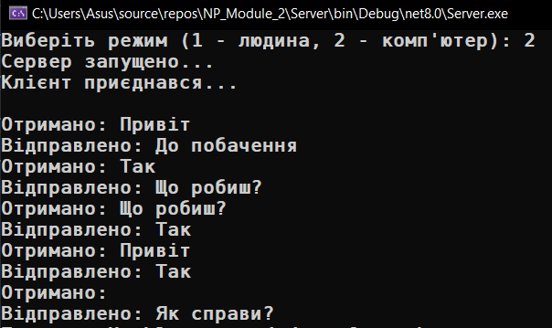

# Module 2

## Client-Server (human <-> computer)

- [Server/](Server/)
  - [Program.cs](Server/Program.cs)
- [Client/](Client/)
  - [Program.cs](Client/Program.cs)

## Client Human, Server Computer

    
    

## Client Computer, Server Human

    
    

## Client Computer, Server Computer

    
    

